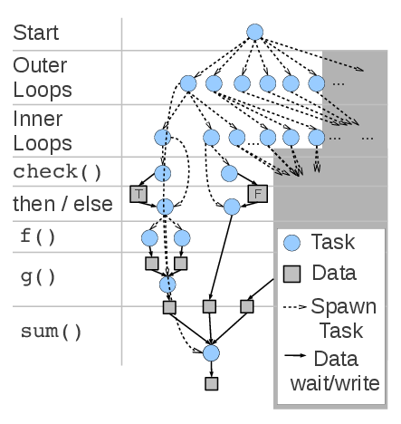

# New programming languages and paradigms in HPC
### Seminar „Neueste Trends im Hochleistungsrechnen“

<small>[Lukas Stabe](mailto:2stabe@informatik.uni-hamburg.de) / 2015-12-07</small>


## Structure

1. Introduction
2. Definitions
<!--    * Language
    * Paradigm
    * Relation-->
3. Advantages of new languages/paradigms
4. Problems
5. Examples
    * SciPy
    * Rust
    * Swift/T
    * OpenMP 4
6. Conclusion


## Definitions: Language

* <q cite="https://en.wikipedia.org/wiki/Programming_language">„A programming language is a formal constructed language designed to communicate instructions to a machine, particularly a computer.“</q> <br>&ndash; Wikipedia
* A programming language defines how you tell the computer to do something
* Languages are closely related to their standard library
    * Boundaries are often unclear

Note:
So a language is what specifies: "you write X and the computer does Y"


## Definitions: Paradigm

* <q cite="https://en.wikipedia.org/wiki/Programming_paradigm">„A programming paradigm is a fundamental style of computer programming, serving as a way of building the structure and elements of computer programs.“</q> <br>&ndash; Wikipedia
* Describes a way to approach problems
* Defines common patterns
* Often explicitly forbids some *anti-patterns*

Note:
- Anti-patterns are usage/programming patterns that are deemed bad practice
- Agent-oriented
- Automata-based
- Data-driven
- Declarative
    - Dataflow
        - Reactive
    - Functional
    - Logic
- Imperative / Procedural
- Inductive programming
- Natural language programming
- Object-oriented (OOP)


## Definitions: Relation

* <q cite="https://en.wikipedia.org/wiki/Programming_paradigm">„Capabilities and styles of various programming languages are defined by their supported programming paradigms; some programming languages are designed to follow only one paradigm, while others support multiple paradigms.“</q> <br>&ndash; Wikipedia
* Most languages support a mix of paradigms
* Standard library may be written with a concrete paradigm in mind

Note:
- C++: object-oriented & imperative
- C: procedural, but ppl have built class systems
- C standard library (part of standard) often only returns status code from functions, returns actual data by reference (modifying state)


## Advantages of new languages/paradigms

* Simplify development
* Fewer kinds of errors possible
* Produces easier-to-maintain code
    * Easier to write (in a good/idiomatic manner) for inexperienced programmers
    * This is a result of the community surrounding the language
    * Unit-testing
    * Documentation
* Better utilize available resources

Note:
- trusty old C/Fortran, why something else?
- concrete examples later
- simplify development: no complexities of e.g. c (pointers) or simplify things like ipc (mpi)
- fewer kinds of errors: type system, memory-safety
- easier to write: lots of inexperienced programmers in hpc (scientists)
- easier-to-maintain: important in hpc, because scientists write code, cluster operators maintain
- available resources: accelerators, vector units


## Problems

* A large existing codebase of C/Fortran code
* Smaller ecosystem of libraries/tools (esp. related to HPC)
* Huge expertise of experienced programmers
* C/Fortran compilers have been worked on for decades, so they can optimize code extremely well

Note:
- existing codebase: c ffi
- smaller ecosystem (eg valgrind): c ffi
- expertise: important bc in hpc we need performance
- optimizations: compile down to c?


## Example: [SciPy](http://scipy.org)

* Python library
* Wraps compiled Fortran and C code
* Write program flow and high-level structure in Python
* Keep hotspots in compiled code
* Near-native performance


## Example: [Rust](https://www.rust-lang.org)

* Compiled low-level language
* Strong type and generics system with type inference
* Guarantees memory safety
* Thread-safety
* MPI bindings [in development](https://github.com/bsteinb/rsmpi)

Note:
- thread safety due to only one reference to data which may write
- no conclusive performance benchmarks
    - depends on algorithm, implementation, ...
    - seems like it can be as fast as c in some cases


## Example: [Rust](https://www.rust-lang.org)

```rust
fn main() {
    // A simple integer calculator:
    // `+` or `-` means add or subtract by 1
    // `*` or `/` means multiply or divide by 2
    let program = "+ + * - /";
    let mut accumulator = 0;

    for token in program.chars() {
        match token {
            '+' => accumulator += 1,
            '-' => accumulator -= 1,
            '*' => accumulator *= 2,
            '/' => accumulator /= 2,
            _ => { /* ignore everything else */ }
        }
    }
}
```

Note:
- point out that there is not a single type explicitly written down, yet everything is statically typed


## Example: [Rust](https://www.rust-lang.org)

```rust
extern crate mpi;

use mpi::traits::*;

fn main() {
    let universe = mpi::initialize().unwrap();
    let world = universe.world();
    let size = world.size();
    let rank = world.rank();

    if size != 2 {
        panic!("Size of MPI_COMM_WORLD must be 2, but is {}!", size);
    }

    match rank {
        0 => {
            let msg = vec![4.0f64, 8.0, 15.0];
            world.process_at_rank(rank + 1).send(&msg[..]);
        }
        1 => {
            let (msg, status) = world.receive_vec::<f64>();
            println!("Process {} got message {:?}.\nStatus is: {:?}",
                rank, msg, status);
        }
        _ => unreachable!()
    }
}
```

Note:
- conclusion: rust might not be much easier, but it prevents whole classes of errors from being made


## Example: [Swift/T](http://swift-lang.org/Swift-T/)

* Swift script translates into MPI program
* Calls leaf tasks written in C, C++, Fortran, Python, R, Tcl, Julia, Qt Script, or executable programs
* Coordinates data flow between leaf tasks
* Executes leaf tasks concurrently where possible

Note:
- remember when I said "simplify ipc"? this is it
- okay so swift scripts look a lot like c, but each function call is actually executing a leaf node, and those are ...


## Example: [Swift/T](http://swift-lang.org/Swift-T/)

<div style="display:flex; align-items: center;">
<pre style="width: 50%;"><code style="padding-left: 10px;">
int X = 100, Y = 100;
int A[][];
int B[];
foreach x in [0:X-1] {
  foreach y in [0:Y-1] {
    if (check(x, y)) {
      A[x][y] = g(f(x), f(y));
    } else {
      A[x][y] = 0;
    }
  }
  B[x] = sum(A[x]);
}

</code></pre>


</div>

Note:
- blue dots are tasks that are spawned
- full arrows represent data flow


## Example: [OpenMP 4](http://openmp.org/)

* Compiler directives on top of C, C++ and Fortran
* Interesting new features in version 4
    * SIMD directive
        * Uses vector units like AVX/SSE and NEON to do multiple numeric operations in parallel on one core
        * Works combined with `omp parallel`
    * TARGET directive
        * Runs code on accelerators
        * transfers in- and output data back and forth

Note:
- you probably all know OpenMP
- explain vector instructions
- Oliver already talked about accelerators in-depth


## Example: [OpenMP 4](http://openmp.org/)

```
void vadd_openmp(float *a, float *b, float *c, int len)
{
    #pragma omp target map(to:a[0:len],b[0:len],len) map(from:c[0:len])
    {
        int i;
        #pragma omp parallel for
        for (i = 0; i < size; i++)
            c[i] = a[i] + b[i];

    }
}
```

Note:
- in the mapping: `to` moves data to the accelerator, `from` moves data back


## Conclusion

* New languages and paradigms can provide big benefits
    * Easier development
    * Easier-to-maintain code
    * Utilize new types of hardware
* They need to overcome some significant challenges
    * Large existing codebase/ecosystem
    * Raw speed
* Nothing can replace C/C++/Fortran right now
    * Rust looks promising


## Sources

* Quote on slide 3: [Wikipedia: Programming language](https://en.wikipedia.org/wiki/Programming_language)
* Quote on slide 4, 5: [Wikipedia: Programming paradigm](https://en.wikipedia.org/wiki/Programming_paradigm)
* Sample code on slide 10: [rust-lang.org](https://www.rust-lang.org/)
* Sample code on slide 11: [GitHub: bsteinb/rsmpi](https://github.com/bsteinb/rsmpi)
* Image and sample code on slide 13: [swift-lang.org/Swift-T](http://swift-lang.org/Swift-T/)
* Sample code on slide 15: [TI Wiki: OpenMP Accelerator Model 0.3.3](http://processors.wiki.ti.com/index.php/OpenMP_Accelerator_Model_0.3.3)
